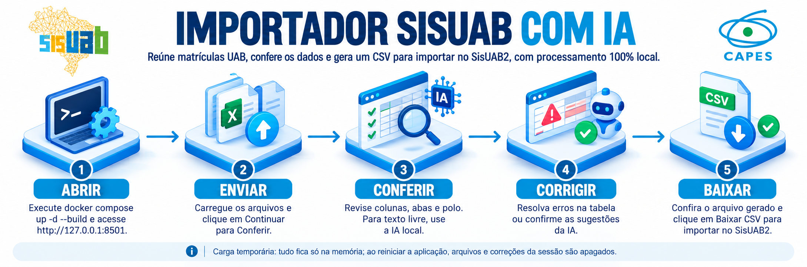

<p align="center">
    
</p>

<hr/>

# Importador SisUAB com IA

Aplicação local para conferir matrículas UAB e gerar o CSV de importação do SisUAB2. Os dados dos alunos ficam na memória da sessão. A IA é opcional para planilhas e necessária para extrair dados de texto livre; ela usa somente um Ollama local.

Baixe o projeto com `git clone https://github.com/istofel/sisuab-uab.git` e entre na pasta `sisuab-uab`. Também é possível baixar o ZIP do repositório e extraí-lo antes de seguir as instruções abaixo.

## Instalação

Escolha uma das opções abaixo: Python 3.11 ou superior para executar sem Docker, ou Docker com Compose. A meta para a aplicação é usar até 1 GB de RAM; para usar a IA local, estime 8 a 16 GB de RAM na máquina e espaço adicional para o modelo. Se usar o Ollama instalado no computador, [instale-o](https://ollama.com/download) e baixe `qwen3.5:9b` (cerca de 6,6 GB):

```sh
ollama pull qwen3.5:9b
```

### Inicialização automática com Docker

Instale o Docker com Compose. No Windows e macOS, instale também o Ollama e baixe o modelo conforme o comando acima. Depois:

- **Windows:** dê dois cliques em `run.bat`.
- **Linux/macOS:** execute:

```sh
./run.sh
```

Os scripts copiam `.env.example` para `.env` na primeira execução, iniciam o Docker e o Ollama se estiverem parados, aguardam os serviços e executam `docker compose up -d --build app`. Não é necessário instalar Python nesse modo. A aplicação fica em <http://127.0.0.1:8501>; para mudar a porta, edite `APP_PORT` em `.env`.

No Linux, `run.sh` inicia o Ollama no Compose. Na primeira utilização, baixe o modelo desse serviço:

```sh
docker compose --profile ollama exec ollama ollama pull qwen3.5:9b
```

Os scripts iniciam programas já instalados; não instalam o Docker Desktop ou o Ollama do host. No Linux, pode ser solicitada a senha de administrador para iniciar o serviço Docker. Rodar os scripts novamente pode recriar o contêiner da aplicação se houver atualizações, apagando a carga atual da memória.

### Docker manual

No Windows ou macOS, inicie o Ollama no host e execute:

```sh
docker compose up -d --build
```

O contêiner acessa o Ollama do host por `host.docker.internal`. No Linux, use o profile local do Compose:

```sh
cp .env.example .env
# Edite OLLAMA_DOCKER_URL=http://ollama:11434 em .env
docker compose --profile ollama up -d --build
docker compose --profile ollama exec ollama ollama pull qwen3.5:9b
```

No Windows, substitua `cp` por `copy` se estiver no Prompt de Comando. A interface fica em <http://127.0.0.1:8501> em todos os casos. Confira os serviços com `docker compose ps`; encerre com `docker compose --profile ollama down`. O Compose publica somente a porta local da aplicação. O Ollama do profile não publica porta no host.

### Sem Docker

Com Python 3.11 ou superior e o Ollama iniciado, crie um ambiente e execute:

```sh
python -m venv .venv
# Linux/macOS:
source .venv/bin/activate
# Windows (Prompt de Comando): .venv\Scripts\activate.bat
python -m pip install -r requirements.txt
python -m streamlit run app.py
```

## Como usar

1. **Enviar:** carregue um ou mais arquivos CSV, XLSX, XLS, JSON, TXT, PDF ou DOCX. Arquivos de vários polos entram na mesma carga. Remova um arquivo se não fizer parte dela e clique em **Continuar para Conferir**.
2. **Conferir:** revise as abas, colunas detectadas, linhas descartadas e o polo padrão do arquivo. Confirme os arquivos que pedirem confirmação. Para texto livre, clique em **Ler trechos com a IA** e confira a contagem e os registros extraídos. Com ao menos um registro confirmado e sem arquivos pendentes, clique em **Continuar para Corrigir**. Um polo aproximado é apenas sugestão.
3. **Corrigir:** revise os erros e avisos, edite os valores na tabela ou aceite sugestões. Cada erro corrigido desaparece da lista após a revalidação. Alterações propostas no chat só são aplicadas após clicar em **Aplicar selecionadas**. CPF duplicado, mesmo idêntico, deve ser resolvido manualmente; telefone de 8 dígitos precisa de correção, sem prefixo automático. Quando não houver erros nem alterações aguardando confirmação, clique em **Continuar para Baixar**. Avisos não bloqueiam o avanço.
4. **Baixar:** clique em **Conferir arquivo gerado** e depois em **Baixar CSV**. Uma edição posterior exige nova conferência. O CSV tem sete campos, separados por `;`, sem cabeçalho, aspas ou BOM.

As quatro etapas também aparecem na barra de navegação. A aplicação impede abrir uma etapa que ainda não atende às condições de avanço. Arquivos e correções ficam somente na memória: reiniciar a aplicação ou recriar o contêiner apaga a carga atual.

### Lista de polos

Edite [config/polos.txt](config/polos.txt) para usar os nomes **exatamente** como aparecem na oferta do SisUAB, um por linha. Reinicie a aplicação após alterar a lista. O arquivo [config/ddds.txt](config/ddds.txt) contém os DDDs válidos e pode ser atualizado da mesma forma.

### Riscos do manual SisUAB

- **R4:** o manual da CAPES diverge sobre CPF já existente na oferta: uma seção diz que o registro é alterado, outra que é ignorado. Confirme o comportamento em uma importação piloto antes de uma carga real.
- **R5:** na inclusão, o SisUAB pode gravar o aluno como **CURSANDO** e sobrescrever outra situação. Confira a situação no SisUAB após importar.

## Privacidade

Não envie planilhas com dados reais para relatórios de erro ou ferramentas externas. Os arquivos e as correções da carga não são salvos pela aplicação e deixam de estar disponíveis quando a sessão é encerrada.
